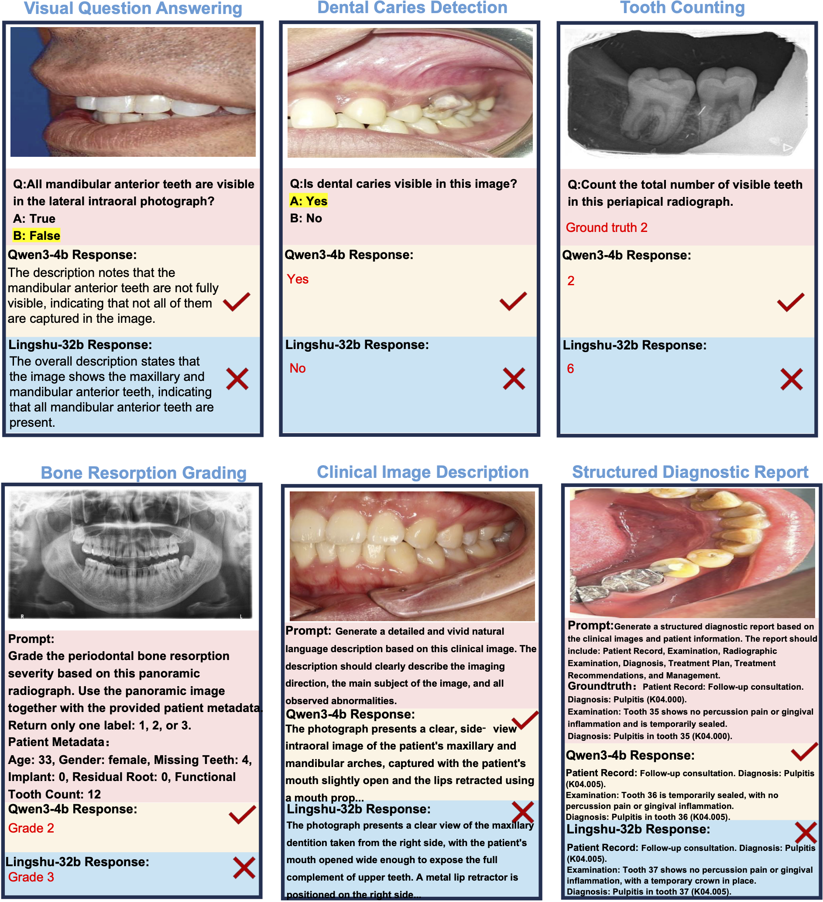
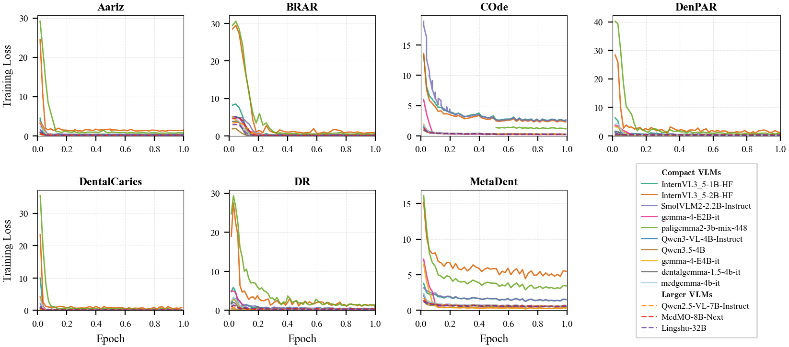

# Pocket-Dentist

**Benchmarking Compact Vision-Language Models for Dental Image Understanding**

[](https://anonymous.4open.science/r/pocket-dentist-DD77)
[](LICENSE)

> **Paper**: Pocket-Dentist: Benchmarking Compact Vision-Language Models for Dental Image Understanding
>
> **Venue**: NeurIPS 2026 Evaluations & Datasets Track (under review)

---

## Table of Contents

1. [Introduction](#overview) — What is Pocket-Dentist?
2. [Development Guide](#getting-started) — Environment setup, inference, and training
3. [Appendix: Qualitative Analysis](#qualitative-analysis)

---

## Overview

Pocket-Dentist is a **large-scale multimodal benchmark and deploy-aware evaluation pipeline** for dental vision-language models (VLMs). It curates and standardizes seven heterogeneous dental datasets into a unified vision-language benchmark, enabling systematic evaluation of VLMs across diverse imaging modalities, clinical task types, adaptation strategies, and deployment constraints.

### Key Highlights

- **7 dental datasets** spanning panoramic radiographs, intraoral photographs, periapical radiographs, and cephalometric radiographs
- **71,000+ images** from **6,000+ patients**, covering **6 task types** and **14 evaluation metrics**
- **14 VLMs evaluated** under zero-shot, few-shot (1-shot, 2-shot), and LoRA fine-tuning settings
- **Core finding**: Under a uniform low-cost LoRA adaptation budget, compact VLMs — especially **Qwen3-VL-4B** — match or outperform substantially larger open-weight models (7B–32B) on most primary task metrics

### Benchmark Datasets

| Dataset | Modality | Task Types | Test Size | Primary Metric |
|---------|----------|------------|-----------|----------------|
| **COde** | Intraoral photo + Panoramic X-ray | Classification, Report Generation | 1,200 | Weighted F1 / BERTScore F1 |
| **MetaDent** | Intraoral photograph | VQA, Classification, Captioning | 2,301 | Accuracy / Weighted F1 / BERTScore F1 |
| **BRAR** | Panoramic radiograph | Classification (Grade 1/2/3) | 149 | Macro F1 |
| **Aariz** | Cephalometric radiograph | VQA, CVM Classification | 630 / 126 | Accuracy |
| **DenPAR** | Periapical radiograph | Architecture, Site, Counting | 200 × 3 | Accuracy / Weighted F1 / MAE ↓ |
| **DentalCaries** | Intraoral photograph | Detection, Dentition Classification | 628 / 226 | Accuracy / Weighted F1 |
| **DR** | Panoramic X-ray | Multi-label Classification | 73 | Weighted F1 |

### Evaluated Models

| Tier | Models |
|------|--------|
| **Large VLMs (≥ 7B)** | Lingshu-32B, MedMO-8B-Next, Qwen2.5-VL-7B, Gemini-2.0-Flash, Gemini-2.5-Flash |
| **Compact VLMs (≤ 4B)** | Qwen3-VL-4B, Qwen3.5-4B, gemma-4-E4B-it, gemma-4-E2B-it, SmolVLM2-2.2B, InternVL3.5-2B, InternVL3.5-1B, medgemma-4b-it, paligemma2-3b-mix-448 |

---

## Getting Started

For detailed instructions on environment setup, running evaluation, SFT training, and data format specifications, see the **[Development Guide](Development.md)**.

### Quick Start

```bash
# Install dependencies
pip install -r requirements.txt

# Run zero-shot evaluation on MetaDent with a single model
bash scripts/run_metadent.sh --models Qwen3-VL-4B-Instruct --tasks baseline

# Run LoRA fine-tuning
bash scripts/run_metadent_sft.sh --models Qwen3-VL-4B-Instruct
```

### Hardware Requirements

| Environment | Purpose | Min GPU | Max GPU |
|-------------|---------|---------|---------|
| `NeurlPS2026-benchmark` | vLLM inference + evaluation | A100 40GB (1–4B models) | H100 96GB (32B models) |
| `NeurlPS2026-train` | LoRA SFT training | A100 40GB (1–4B models) | H100 96GB (32B models) |

---

## Qualitative Analysis

To illustrate the practical impact of compact-model adaptation, we present representative test-set cases across all six task types in which the LoRA-adapted **Qwen3-VL-4B** (4B parameters) produces correct predictions, whereas the substantially larger **Lingshu-32B** (32B parameters), adapted with the same LoRA budget, fails.

All cases are from the SFT (LoRA) setting and selected from test-set predictions.

<p align="center">
  
</p>

> 📄 For higher resolution, see the [full PDF version](assets/appendix_+.pdf).

### Training Loss

Training loss curves for LoRA-based instruction tuning across seven dental datasets. Each subplot displays the training loss over one epoch for all 13 evaluated VLMs, grouped into Compact VLMs (≤4B parameters, solid lines) and Larger VLMs (≥7B parameters, dashed lines). All models are fine-tuned with identical LoRA configurations (r=16, α=32) and a cosine learning rate schedule. Most models converge rapidly within the first 10–20% of training, with InternVL3.5 and PaliGemma2 exhibiting notably higher initial loss due to their less-aligned vision–language representations. The consistently low final loss of MedMO-8B-Next and Qwen2.5-VL-7B across all datasets reflects their stronger pre-trained foundations for medical image understanding.

<p align="center">
  
</p>

> 📄 For higher resolution, see the [full PDF version](assets/training_loss_curves-1.pdf).

---

## Citation

```bibtex
@inproceedings{pocket-dentist-2026,
  title     = {Pocket-Dentist: Benchmarking Compact Vision-Language Models for Dental Image Understanding},
  author    = {Anonymous},
  booktitle = {NeurIPS 2026 Evaluations \& Datasets Track},
  year      = {2026},
  note      = {Under review}
}
```

## License

This project is licensed under the [Apache License 2.0](LICENSE).
