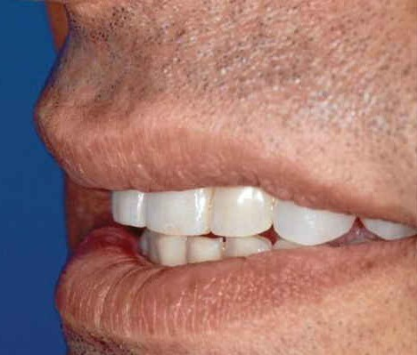
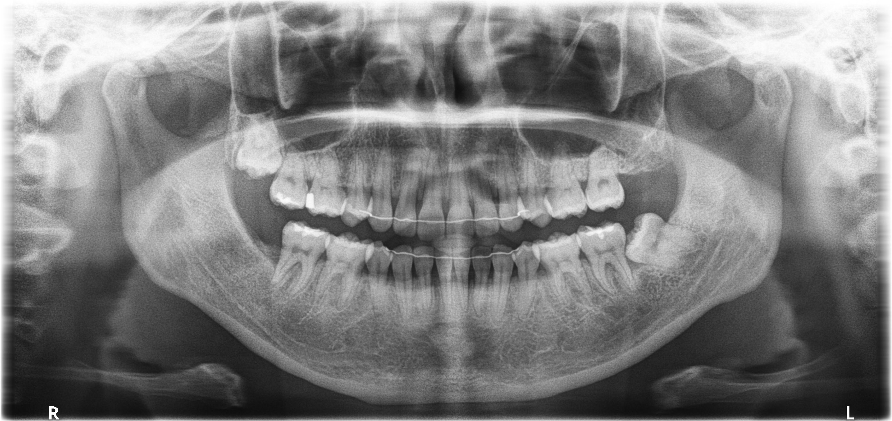
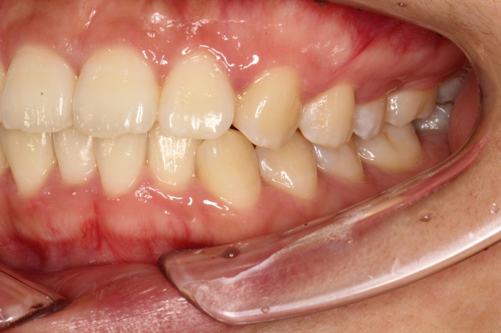
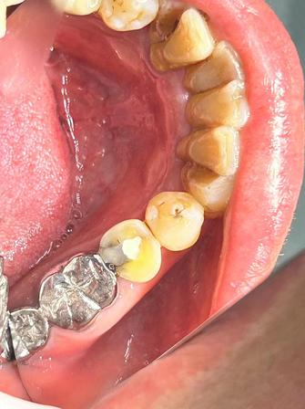
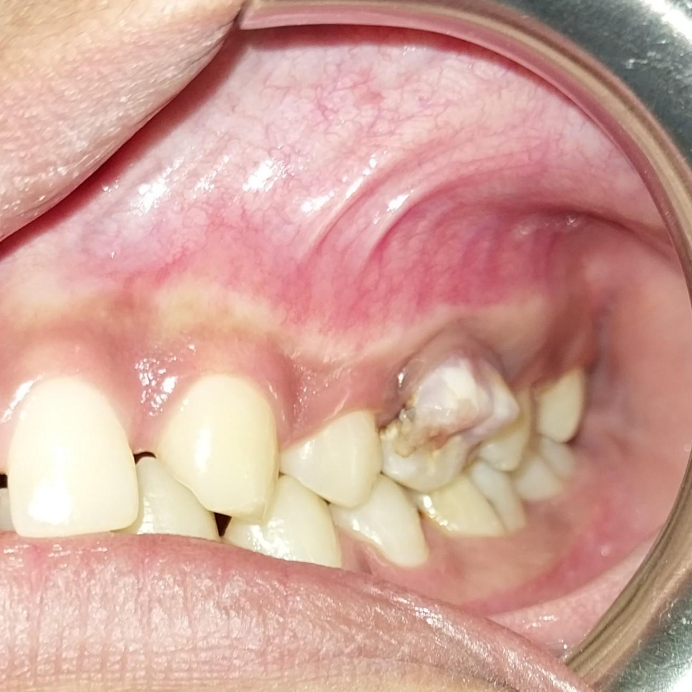
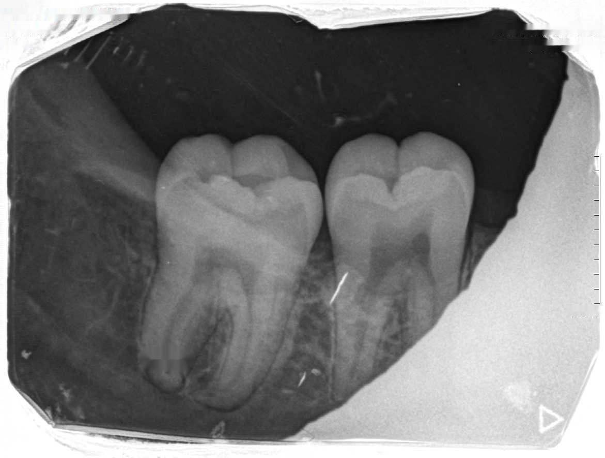

# Pocket-Dentist

**Benchmarking Compact Vision-Language Models for Dental Image Understanding**

[](https://anonymous.4open.science/r/pocket-dentist-DD77)
[](LICENSE)

> **Paper**: Pocket-Dentist: Benchmarking Compact Vision-Language Models for Dental Image Understanding
>
> **Venue**: NeurIPS 2026 Evaluations & Datasets Track (under review)

---

## Table of Contents

1. [Introduction](#overview) — What is Pocket-Dentist?
2. [Development Guide](#getting-started) — Environment setup, inference, and training
3. [Appendix: Qualitative Case Studies](#qualitative-analysis) — Supplementary analysis across 6 clinical task types

---

## Overview

Pocket-Dentist is a **large-scale multimodal benchmark and deploy-aware evaluation pipeline** for dental vision-language models (VLMs). It curates and standardizes seven heterogeneous dental datasets into a unified vision-language benchmark, enabling systematic evaluation of VLMs across diverse imaging modalities, clinical task types, adaptation strategies, and deployment constraints.

### Key Highlights

- **7 dental datasets** spanning panoramic radiographs, intraoral photographs, periapical radiographs, and cephalometric radiographs
- **71,000+ images** from **6,000+ patients**, covering **6 task types** and **14 evaluation metrics**
- **14 VLMs evaluated** under zero-shot, few-shot (1-shot, 2-shot), and LoRA fine-tuning settings
- **Core finding**: Under a uniform low-cost LoRA adaptation budget, compact VLMs — especially **Qwen3-VL-4B** — match or outperform substantially larger open-weight models (7B–32B) on most primary task metrics

### Benchmark Datasets

| Dataset | Modality | Task Types | Test Size | Primary Metric |
|---------|----------|------------|-----------|----------------|
| **COde** | Intraoral photo + Panoramic X-ray | Classification, Report Generation | 1,200 | Weighted F1 / BERTScore F1 |
| **MetaDent** | Intraoral photograph | VQA, Classification, Captioning | 2,301 | Accuracy / Weighted F1 / BERTScore F1 |
| **BRAR** | Panoramic radiograph | Classification (Grade 1/2/3) | 149 | Macro F1 |
| **Aariz** | Cephalometric radiograph | VQA, CVM Classification | 630 / 126 | Accuracy |
| **DenPAR** | Periapical radiograph | Architecture, Site, Counting | 200 × 3 | Accuracy / Weighted F1 / MAE ↓ |
| **DentalCaries** | Intraoral photograph | Detection, Dentition Classification | 628 / 226 | Accuracy / Weighted F1 |
| **DR** | Panoramic X-ray | Multi-label Classification | 73 | Weighted F1 |

### Evaluated Models

| Tier | Models |
|------|--------|
| **Large VLMs (≥ 7B)** | Lingshu-32B, MedMO-8B-Next, Qwen2.5-VL-7B, Gemini-2.0-Flash, Gemini-2.5-Flash |
| **Compact VLMs (≤ 4B)** | Qwen3-VL-4B, Qwen3.5-4B, gemma-4-E4B-it, gemma-4-E2B-it, SmolVLM2-2.2B, InternVL3.5-2B, InternVL3.5-1B, medgemma-4b-it, paligemma2-3b-mix-448 |

---

## Getting Started

For detailed instructions on environment setup, running evaluation, SFT training, and data format specifications, see the **[Development Guide](Development.md)**.

### Quick Start

```bash
# Install dependencies
pip install -r requirements.txt

# Run zero-shot evaluation on MetaDent with a single model
bash scripts/run_metadent.sh --models Qwen3-VL-4B-Instruct --tasks baseline

# Run LoRA fine-tuning
bash scripts/run_metadent_sft.sh --models Qwen3-VL-4B-Instruct
```

### Hardware Requirements

| Environment | Purpose | Min GPU | Max GPU |
|-------------|---------|---------|---------|
| `NeurlPS2026-benchmark` | vLLM inference + evaluation | A100 40GB (1–4B models) | H100 96GB (32B models) |
| `NeurlPS2026-train` | LoRA SFT training | A100 40GB (1–4B models) | H100 96GB (32B models) |

---

## Qualitative Analysis

To illustrate the practical impact of compact-model adaptation, we present representative test-set cases across all six task types in which the LoRA-adapted **Qwen3-VL-4B** (4B parameters) produces correct predictions, whereas the substantially larger **Lingshu-32B** (32B parameters), adapted with the same LoRA budget, fails.

All cases are from the SFT (LoRA) setting and selected from test-set predictions.

---

### 1. VQA (Visual Question Answering)

**Case ID: `22966`** · **Dataset: MetaDent**



**Question**: All mandibular anterior teeth are visible in the lateral intraoral photograph.
**Choices**: A: True, B: False

**✅ Ground Truth**:
```json
{"answer": "B", "reason": "Because the photograph is a lateral view taken from the left side, only the left portion of the mandibular anterior region is captured; the right-side anterior teeth are not visible. Therefore the statement is false."}
```

**❌ Lingshu-32B (SFT)**:
```json
{"answer": "A", "reason": "The overall description states that the image shows the maxillary and mandibular anterior teeth, indicating that all mandibular anterior teeth are present."}
```
> ⚠️ Lingshu failed to recognize the lateral-view perspective constraint, incorrectly judging that all mandibular anterior teeth are visible.

**✅ Qwen3-VL-4B (SFT)**:
```json
{"answer": "B", "reason": "The description notes that the mandibular anterior teeth are not fully visible, indicating that not all of them are captured in the image."}
```

---

### 2. Classification (Bone Resorption Grading)

**Case ID: `patient_image_000223_4ebeaf32`** · **Dataset: BRAR**



**Question**: Grade the periodontal bone resorption severity (1, 2, or 3) based on this panoramic radiograph.

**✅ Ground Truth**: `{"grade": 2}`

**❌ Lingshu-32B (SFT)**: `{"grade": 3}`
> ⚠️ **Upgrade misclassification** (Grade 2 → 3): Moderate bone resorption incorrectly graded as severe, potentially leading to overtreatment.

**✅ Qwen3-VL-4B (SFT)**: `{"grade": 2}`

---

### 3. Captioning (Clinical Image Description)

**Case ID: `23182`** · **Dataset: MetaDent**



**Question**: Observe the clinical image and generate a vivid natural language description of the dental findings.

**✅ Ground Truth** (excerpt):
```
In this intraoral photograph the viewer is looking at the labial-buccal aspects of the left side
of both the maxillary and mandibular arches while the patient is in centric occlusion. A clear,
transparent lateral retractor is positioned on the left, gently pulling the cheek and lip tissue
away to expose the teeth and gingiva...
```

**❌ Lingshu-32B (SFT)** (excerpt):
```
The photograph presents a clear view of the maxillary dentition taken from the right side, with
the patient's mouth opened wide enough to expose the full complement of upper teeth. A metal lip
retractor is positioned on the right side...
```
> ⚠️ **Multiple errors**: ① Left side → right side ② Both arches → upper only ③ Transparent plastic → metal retractor ④ Occlusion state incorrect

**✅ Qwen3-VL-4B (SFT)** (excerpt):
```
The photograph presents a clear, side-view intraoral image of the patient's maxillary and
mandibular arches, captured with the patient's mouth slightly open and the lips retracted
using a mouth prop...
```

---

### 4. Report Generation (Structured Diagnostic Report)

**Case ID: `code_rpt_00529`** · **Dataset: COde**



**Question**: Generate a complete diagnostic report based on the clinical images and patient information.

**Patient Info**: 65-year-old female, chief complaint: follow-up for lower-left posterior tooth.

**✅ Ground Truth** (excerpt):
```
Patient Record: Follow-up consultation. Diagnosis: Pulpitis (K04.000).
Examination: Tooth 35 shows no percussion pain or gingival inflammation and is temporarily sealed.
Diagnosis: Pulpitis in tooth 35 (K04.000).
```

**❌ Lingshu-32B (SFT)** (excerpt):
```
Patient Record: Follow-up consultation. Diagnosis: Pulpitis (K04.005).
Examination: Tooth 37 shows no percussion pain or gingival inflammation, with a temporary crown in place.
Diagnosis: Pulpitis in tooth 37 (K04.005).
```
> ⚠️ **Tooth misidentification**: #35 → #37 | **Restoration type error**: temporary seal → temporary crown | **ICD code error**: K04.000 → K04.005

**✅ Qwen3-VL-4B (SFT)** (excerpt):
```
Patient Record: Follow-up consultation. Diagnosis: Pulpitis (K04.005).
Examination: Tooth 36 is temporarily sealed, with no percussion pain or gingival inflammation.
Diagnosis: Pulpitis in tooth 36 (K04.005).
```

---

### 5. Detection (Dental Caries Detection)

**Case ID: `caries_test_00071`** · **Dataset: DentalCaries**



**Question**: Is dental caries visible in this image? (Yes/No)

**✅ Ground Truth**: `Yes`

**❌ Lingshu-32B (SFT)**: `No`
> ⚠️ **False Negative (Missed diagnosis)**: Clearly visible caries lesion in the image, but Lingshu failed to detect it.

**✅ Qwen3-VL-4B (SFT)**: `Yes`

---

### 6. Counting (Tooth Counting)

**Case ID: `denpar_count_178`** · **Dataset: DenPAR**



**Question**: Count the total number of visible teeth in this periapical radiograph.

**✅ Ground Truth**: `2`

**❌ Lingshu-32B (SFT)**: `6`
> ⚠️ **Severe overcounting** (2 → 6): Lingshu counted 6 teeth in a periapical radiograph containing only 2, likely misinterpreting adjacent bone structures or artifacts as teeth.

**✅ Qwen3-VL-4B (SFT)**: `2`

---

## Citation

```bibtex
@inproceedings{pocket-dentist-2026,
  title     = {Pocket-Dentist: Benchmarking Compact Vision-Language Models for Dental Image Understanding},
  author    = {Anonymous},
  booktitle = {NeurIPS 2026 Evaluations \& Datasets Track},
  year      = {2026},
  note      = {Under review}
}
```

## License

This project is licensed under the [Apache License 2.0](LICENSE).
