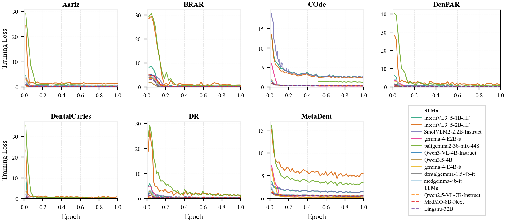

# Pocket-Dentist

**面向牙科图像理解的紧凑型视觉语言模型基准测试**

[](https://anonymous.4open.science/r/pocket-dentist-DD77)
[](LICENSE)

> **论文**: Pocket-Dentist: Benchmarking Compact Vision-Language Models for Dental Image Understanding
>
> **会议**: NeurIPS 2026 Evaluations & Datasets Track（审稿中）

---

## 目录

1. [简介](#概览) — Pocket-Dentist 是什么？
2. [开发指南](#快速开始) — 环境搭建、推理评估与训练
3. [附录：定性案例分析](#定性分析qualitative-analysis) — 6 种临床任务类型的补充分析

---

## 概览

Pocket-Dentist 是一个**大规模多模态基准测试和部署感知评估管线**，用于评估牙科视觉语言模型（VLM）。它整合并标准化了 7 个异构牙科数据集，构建统一的视觉-语言基准，支持在多种成像模态、临床任务类型、适配策略和部署约束下对 VLM 进行系统评估。

### 核心亮点

- **7 个牙科数据集**，涵盖全景 X 光片、口内照片、根尖片和头颅侧位片
- **71,000+ 张图像**，来自 **6,000+ 患者**，覆盖 **6 种任务类型**和 **14 个评估指标**
- **14 个 VLM** 在 zero-shot、few-shot（1-shot、2-shot）和 LoRA 微调设定下评估
- **核心发现**：在统一的低成本 LoRA 适配预算下，紧凑型 VLM——尤其是 **Qwen3-VL-4B**——在大多数主要任务指标上可匹敌甚至超越更大的开源模型（7B–32B）

### 基准数据集

| 数据集 | 模态 | 任务类型 | 测试集大小 | 主要指标 |
|--------|------|---------|-----------|---------|
| **COde** | 口内照片 + 全景 X 光 | 分类、报告生成 | 1,200 | Weighted F1 / BERTScore F1 |
| **MetaDent** | 口内照片 | VQA、分类、描述生成 | 2,301 | Accuracy / Weighted F1 / BERTScore F1 |
| **BRAR** | 全景 X 光片 | 分类（Grade 1/2/3） | 149 | Macro F1 |
| **Aariz** | 头颅侧位片 | VQA、CVM 分类 | 630 / 126 | Accuracy |
| **DenPAR** | 根尖片 | 牙齿结构、位置、计数 | 200 × 3 | Accuracy / Weighted F1 / MAE ↓ |
| **DentalCaries** | 口内照片 | 龋齿检测、牙列分类 | 628 / 226 | Accuracy / Weighted F1 |
| **DR** | 全景 X 光 | 多标签分类 | 73 | Weighted F1 |

### 评估模型

| 层级 | 模型 |
|------|------|
| **大模型（≥ 7B）** | Lingshu-32B, MedMO-8B-Next, Qwen2.5-VL-7B, Gemini-2.0-Flash, Gemini-2.5-Flash |
| **紧凑型模型（≤ 4B）** | Qwen3-VL-4B, Qwen3.5-4B, gemma-4-E4B-it, gemma-4-E2B-it, SmolVLM2-2.2B, InternVL3.5-2B, InternVL3.5-1B, medgemma-4b-it, paligemma2-3b-mix-448 |

---

## 快速开始

环境搭建、运行评估、SFT 训练和数据格式的详细说明请参见 **[Development Guide](Development.md)**。

### 快速上手

```bash
# 安装依赖
pip install -r requirements.txt

# 在 MetaDent 上运行 zero-shot 评估
bash scripts/run_metadent.sh --models Qwen3-VL-4B-Instruct --tasks baseline

# 运行 LoRA 微调
bash scripts/run_metadent_sft.sh --models Qwen3-VL-4B-Instruct
```

### 硬件要求

| 环境 | 用途 | 最低 GPU | 最高 GPU |
|------|------|---------|---------|
| `NeurlPS2026-benchmark` | vLLM 推理 + 评估 | A100 40GB（1–4B 模型） | H100 96GB（32B 模型） |
| `NeurlPS2026-train` | LoRA SFT 训练 | A100 40GB（1–4B 模型） | H100 96GB（32B 模型） |

---

## 定性分析（Qualitative Analysis）

为展示紧凑型模型适配的实际效果，我们从所有 6 种任务类型中各选取一个代表性测试集案例，展示 LoRA 适配后的 **Qwen3-VL-4B**（4B 参数）预测正确，而参数量大 8 倍的 **Lingshu-32B**（32B 参数）在相同 LoRA 预算下预测错误的情况。

所有案例均来自 SFT（LoRA）设定下的测试集预测结果。

<p align="center">
  
</p>

> 📄 高分辨率版本请查看 [完整 PDF](assets/appendix_+.pdf)。

### 训练损失（Training Loss）

LoRA 指令微调在 7 个牙科数据集上的训练损失曲线。每个子图展示了全部 13 个 VLM 在一个 epoch 内的训练损失变化，按 SLM（≤4B 参数，实线）和 LLM（≥7B 参数，虚线）分组。所有模型使用相同的 LoRA 配置（r=16, α=32）和余弦学习率调度。大多数模型在训练的前 10–20% 即快速收敛，InternVL3.5 和 PaliGemma2 由于视觉-语言表征对齐程度较低，初始损失明显较高。MedMO-8B-Next 和 Qwen2.5-VL-7B 在所有数据集上始终保持较低的最终损失，反映出其在医学图像理解方面更强的预训练基础。

<p align="center">
  
</p>

> 📄 高分辨率版本请查看 [完整 PDF](assets/training_loss_curves.pdf)。

---

## 引用

```bibtex
@inproceedings{pocket-dentist-2026,
  title     = {Pocket-Dentist: Benchmarking Compact Vision-Language Models for Dental Image Understanding},
  author    = {Anonymous},
  booktitle = {NeurIPS 2026 Evaluations \& Datasets Track},
  year      = {2026},
  note      = {Under review}
}
```

## 许可证

本项目采用 [Apache License 2.0](LICENSE) 许可协议。
